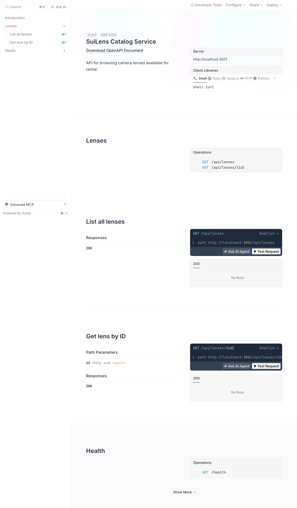
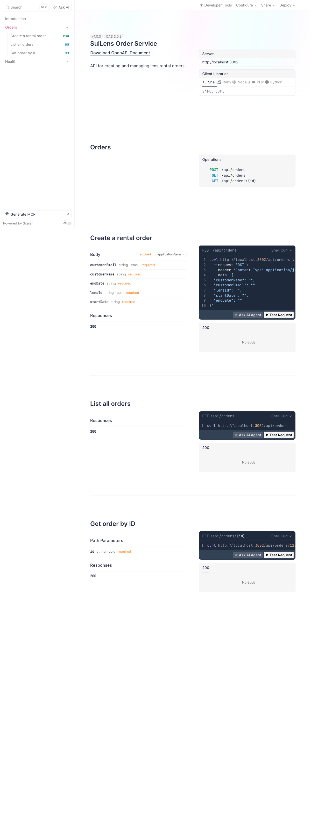
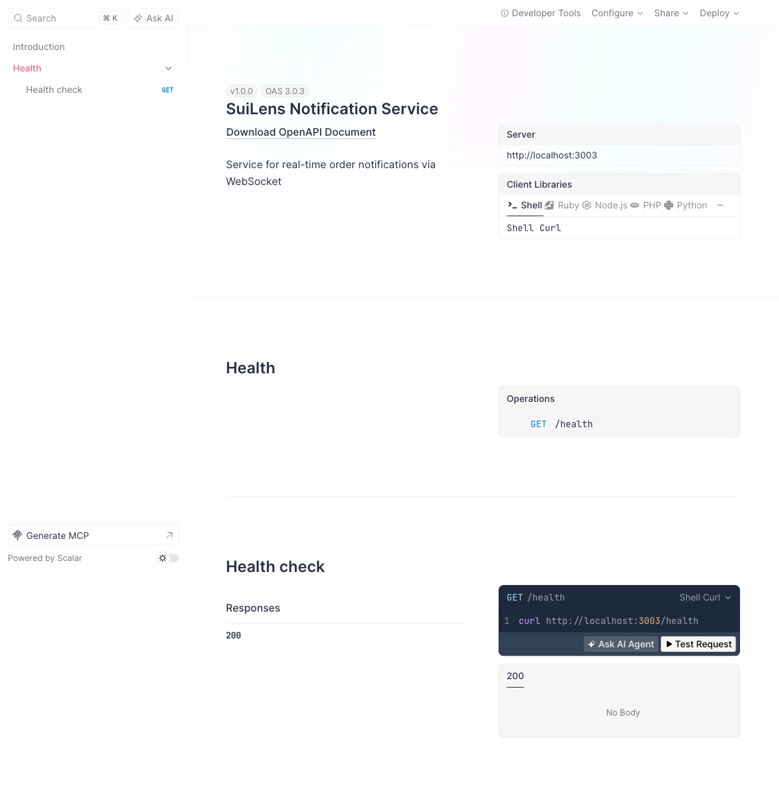
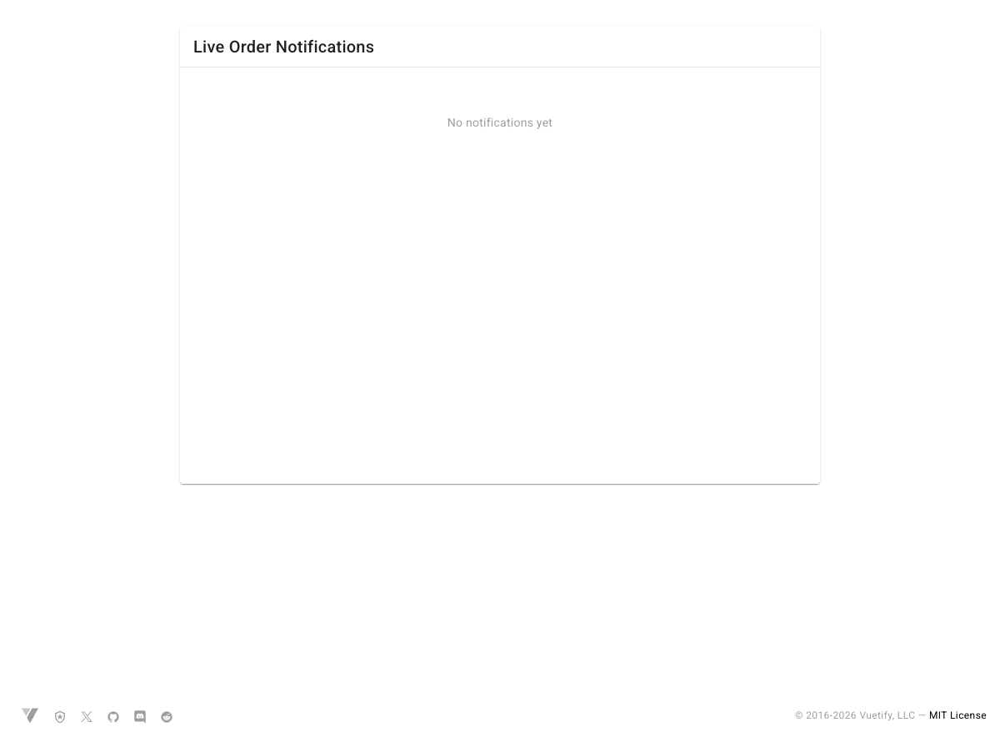
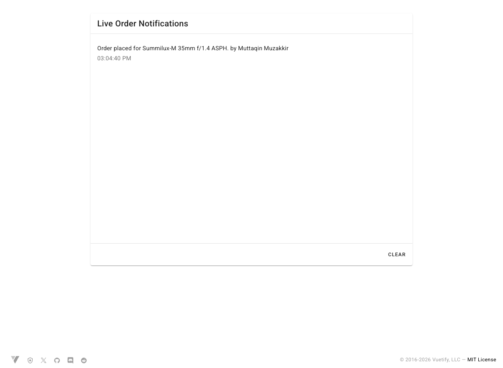
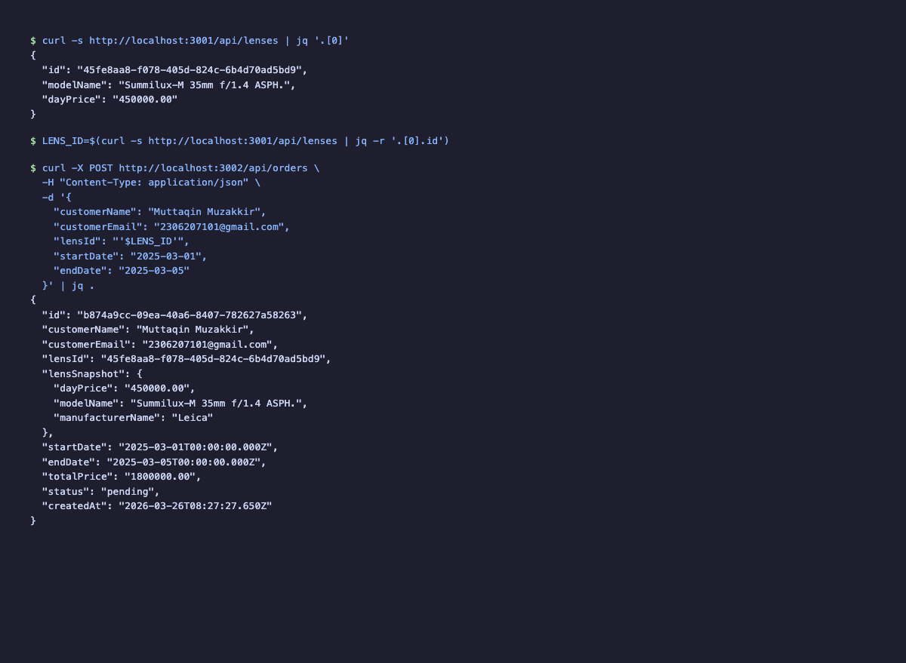
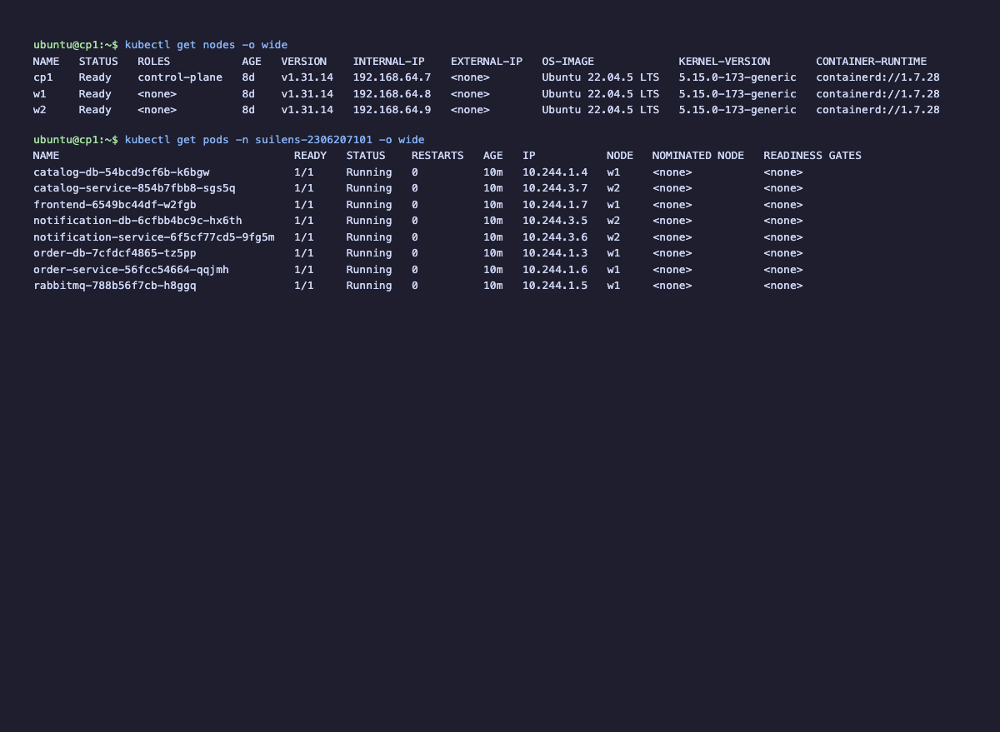

# SuiLens — Microservices Lens Rental Platform

**Assignment A03 — API and Kubernetes Deployment**
**CSCE604271 — Arsitektur Aplikasi Web**
**Muttaqin Muzakkir — 2306207101**

## Architecture

SuiLens is a microservices-based camera lens rental platform consisting of:

| Service | Port | Description |
|---------|------|-------------|
| **catalog-service** | 3001 | Lens inventory and pricing |
| **order-service** | 3002 | Rental order management |
| **notification-service** | 3003 | Real-time notifications via WebSocket |
| **frontend** | 5173 | Vue 3 + Vuetify UI |

**Infrastructure**: PostgreSQL (per-service), RabbitMQ (event bus)

**Communication flow**:
1. Frontend → order-service (POST /api/orders)
2. order-service → catalog-service (validate lens)
3. order-service → RabbitMQ (publish `order.placed`)
4. notification-service ← RabbitMQ (consume event)
5. notification-service → Frontend (WebSocket broadcast)

## Run Locally

```bash
docker compose up --build -d

# Migrate and seed
(cd services/catalog-service && bun install --frozen-lockfile && bunx drizzle-kit push)
(cd services/order-service && bun install --frozen-lockfile && bunx drizzle-kit push)
(cd services/notification-service && bun install --frozen-lockfile && bunx drizzle-kit push)
(cd services/catalog-service && bun run src/db/seed.ts)
```

## Smoke Test

```bash
curl http://localhost:3001/api/lenses | jq
LENS_ID=$(curl -s http://localhost:3001/api/lenses | jq -r '.[0].id')

curl -X POST http://localhost:3002/api/orders \
  -H "Content-Type: application/json" \
  -d '{
    "customerName": "Muttaqin Muzakkir",
    "customerEmail": "2306207101@gmail.com",
    "lensId": "'"$LENS_ID"'",
    "startDate": "2025-03-01",
    "endDate": "2025-03-05"
  }' | jq

docker compose logs notification-service --tail 20
```

## Stop

```bash
docker compose down
```

## OpenAPI Documentation

Each service exposes Swagger UI at `/swagger`:

- **Catalog Service**: http://localhost:3001/swagger
- **Order Service**: http://localhost:3002/swagger
- **Notification Service**: http://localhost:3003/swagger

### Catalog Service — OpenAPI



### Order Service — OpenAPI



### Notification Service — OpenAPI



## WebSocket Implementation

The notification-service exposes a WebSocket endpoint at `ws://localhost:3003/ws`. When an order is placed, the event flows through RabbitMQ to the notification-service, which broadcasts it to all connected WebSocket clients in real-time.

The frontend connects to this WebSocket on mount and displays incoming notifications without page refresh.

### Before POST — No Notifications



### After POST — Real-time Notification via WebSocket



### Smoke Test Terminal Output



## Docker Hub Images

| Image | Link |
|-------|------|
| catalog-service | https://hub.docker.com/r/qinnyboy/suilens-catalog |
| order-service | https://hub.docker.com/r/qinnyboy/suilens-order |
| notification-service | https://hub.docker.com/r/qinnyboy/suilens-notification |
| frontend | https://hub.docker.com/r/qinnyboy/suilens-frontend |

## Kubernetes Deployment

Cluster: 1 control plane (`cp1`) + 2 worker nodes (`w1`, `w2`) via Multipass + kubeadm.

### Deploy

```bash
kubectl apply -f k8s/namespace.yaml
kubectl apply -f k8s/databases.yaml
kubectl apply -f k8s/rabbitmq.yaml
kubectl apply -f k8s/catalog-service.yaml
kubectl apply -f k8s/order-service.yaml
kubectl apply -f k8s/notification-service.yaml
kubectl apply -f k8s/frontend.yaml
```

### kubectl get nodes -o wide & kubectl get pods -o wide



## GitHub Repository

https://github.com/muttyqt15/a03-suilens
